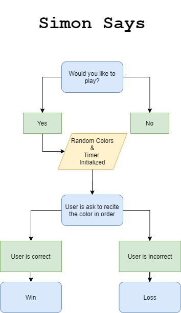

# C++ Final

My final is a shell version of a classic Simon Says. It utilizes loops and arrays learned previously in the course, and makes
use of new tools such as a timer, popup window and console text editing.

## Flowchart

## Video
https://youtu.be/tTlHDdP1jMk
## Acknowlegdement
<b>Logan Gosch:</b> https://github.com/logan-gosch  
